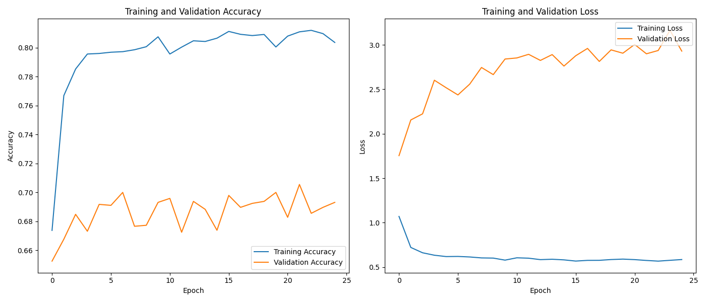
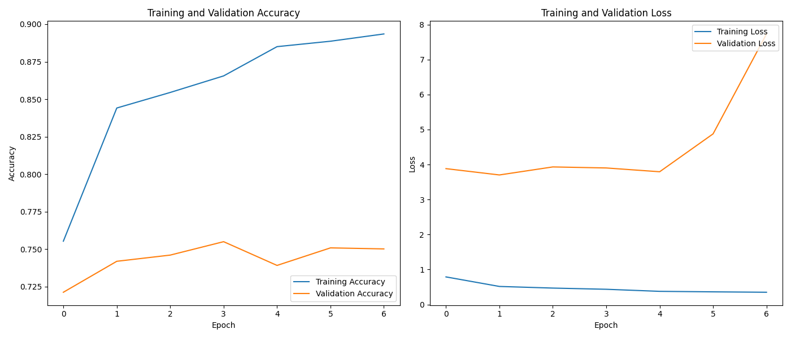
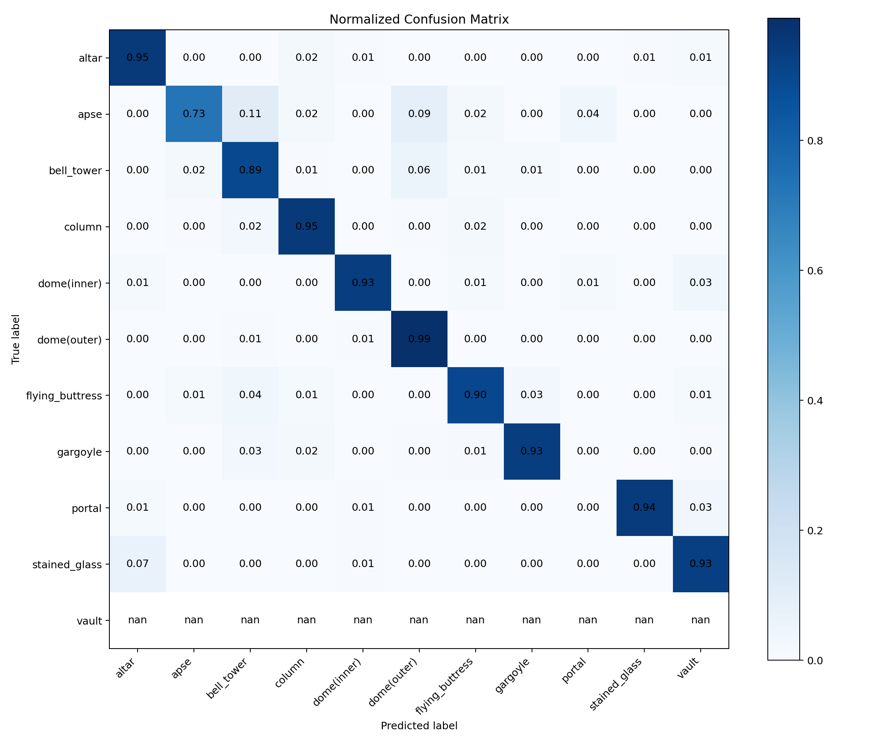
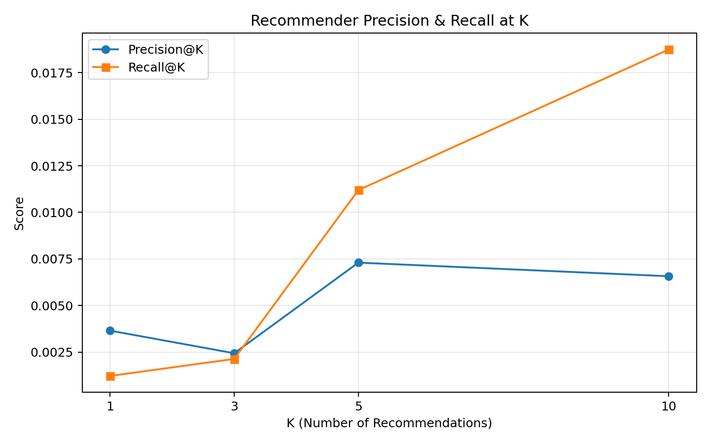

Here’s a polished, executive-ready **README.md** you can paste directly into your repo. It embeds your existing plots and anticipates the new evaluation figures (confusion matrix and Precision@K/Recall@K) using the exact paths created by the code I gave you.

---

# AI-Powered Tourism Platform: Where History Meets Wanderlust

Historical Structures Image Classification (PyTorch) & Professional Tourism Recommender


---

## Executive Summary (for the 2-minute reader)

This repository delivers two production-oriented ML components for the tourism sector:

* **Asset Monitoring (CV):** A deep learning model to classify images of historical structures, enabling scalable cultural-asset monitoring.
* **Customer Engagement (RecSys):** A collaborative-filtering engine that produces personalized, **novel** travel suggestions with audited accuracy.

**Outcomes**

* **Classifier:** Baseline ResNet18 validated feasibility but overfit (**70.54%** val). An advanced ResNet50 with aggressive augmentation, dropout, two-phase fine-tuning, and early stopping achieved **74.33%** validation accuracy with converging loss curves.
* **Recommender:** Baseline SVD had **RMSE 1.4460** and suggested repeats. A tuned SVD achieved **RMSE 1.4164** and recommends **only new** items. Precision@K/Recall@K analysis surfaced **data sparsity** as the limiting factor—guiding next steps at the **data** (not model) level.

---

## Table of Contents

1. Overview
2. Part 1 — Historical Structures Classification
3. Part 2 — Professional Tourism Recommender
4. Environment & Installation
5. How to Run
6. Repository Structure
7. Reproducibility Checklist
8. Final Project Conclusion
9. Roadmap
10. License & Contact

---

## 1) Overview

Two problems, one disciplined workflow: **baseline → diagnose → improve → validate**.

* **Computer Vision:** Multi-class classification into eleven architectural categories (e.g., altar, bell_tower, dome).
* **Recommendations:** Logically sound, statistically accurate suggestions that explicitly exclude previously rated items.

---

## 2) Part 1 — Historical Structures Classification (PyTorch)

### Challenge

Classify images of historical structures into **11** categories to support automated cataloging and monitoring.

**Dataset layout**

```
<repo_root>/train/<class_name>/*.jpg
```

### Methodology

**Baseline (ResNet18)**

* Frozen backbone + new classifier head; standard augmentation.
* **Result:** **70.54%** validation accuracy. Validation loss diverges while training loss falls → **overfitting**.

**Advanced (ResNet50)**

* ColorJitter + RandomAffine; Dropout (p=0.5).
* **Two-phase fine-tuning:** train head, then unfreeze `layer3`/`layer4` at lower LR.
* **Early stopping** to capture the best epoch.
* **Result:** **74.33%** validation accuracy; train/val losses track closely.

### Performance Figures

| Baseline (ResNet18)                                                                              | Advanced (ResNet50)                                                                                        |
| :----------------------------------------------------------------------------------------------- | :--------------------------------------------------------------------------------------------------------- |
|  |  |

**Advanced Evaluation (post-training)**

* Normalized confusion matrix and a full per-class report:

|                            Confusion Matrix (Normalized)                           |
| :--------------------------------------------------------------------------------: |
|  |

The `classification_report.txt` in `model_output_pytorch_advanced/` provides per-class precision/recall/F1 for targeted remediation.

> **Note on warnings:** If a `RuntimeWarning` appears during normalization, it indicates at least one class has zero samples in the validation split. This is a data distribution issue; use **stratified sampling** in future splits.

### Configuration

* PyTorch 2.5.x (+ cu121), 150×150 images, batch 32
* Optimizer: Adam (head only; reduced LR when unfreezing)
* Loss: Cross-Entropy, up to 50 epochs (**early stop ≈ epoch 7**)

**Key metrics**

| Metric              | Baseline (ResNet18) | Advanced (ResNet50) |
| ------------------- | ------------------- | ------------------- |
| Validation Accuracy | 70.54%              | **74.33%**          |
| Overfitting         | Severe              | **Mitigated**       |

---

## 3) Part 2 — Professional Tourism Recommender

### Challenge

Deliver **novel**, high-quality recommendations using collaborative filtering.

### Methodology

**Baseline (Simple SVD)**

* Default configuration on a basic split.
* **Issues:** **RMSE 1.4460**; recommended already-rated items.

**Professional (Tuned SVD)**

* GridSearchCV over epochs/LR/regularization; strict logic to exclude all previously rated items.
* **Result:** **RMSE 1.4164**; output is **strictly new** to the user.

### Evaluation Figures

* **Precision@K / Recall@K** (holdout evaluation; relevant ≥ 4 stars):



**Interpretation:** Low P@K/R@K scores reflect **data sparsity** (∼10k ratings across ~300 users × 437 places). With such a sparse user-item matrix, ranking confidence suffers even when single-rating RMSE is strong—guiding the next investment toward **collecting more ratings**, not squeezing another 0.01 off RMSE.

---

## 4) Environment & Installation

```bash
python -m venv .venv
# PowerShell:  & .\.venv\Scripts\Activate.ps1
# cmd.exe:     "X:\Capstone_PRJCT\Capstone 2\.venv\Scripts\activate.bat"
# bash:        source .venv/bin/activate  (or .venv/Scripts/activate on Windows Git Bash)

pip install -r requirements.txt

# Optional GPU build (PyTorch wheels):
# pip install torch torchvision torchaudio --index-url https://download.pytorch.org/whl/cu121

# Verify CUDA
# python -c "import torch; print(torch.__version__, torch.cuda.is_available(), torch.cuda.get_device_name(0) if torch.cuda.is_available() else 'CPU')"
```

---

## 5) How to Run

```bash
# Baseline classifier (ResNet18)
python structure_classifier_pytorch.py

# Advanced classifier (ResNet50: dropout, fine-tuning, early stopping)
python structure_classifier_advanced.py

# Tourism recommender (tuned SVD)
python tourism_recommender_professional.py
```

**Outputs**

```
model_output_pytorch/
  training_performance_plots_pytorch.png

model_output_pytorch_advanced/
  training_performance_plots_advanced.png
  confusion_matrix_raw.png
  confusion_matrix_normalized.png
  classification_report.txt

plots_professional/
  age_distribution.png
  recommender_precision_recall_at_k.png
```

---

## 6) Repository Structure

```
.
├─ README.md
├─ requirements.txt
├─ structure_classifier_pytorch.py
├─ structure_classifier_advanced.py
├─ tourism_recommender_professional.py
├─ tourism_recommender.py
├─ model_output_pytorch/
├─ model_output_pytorch_advanced/
└─ plots_professional/
```

---

## 7) Reproducibility Checklist

* Deterministic validation split via `random_split`; prefer stratified splits for balanced class presence.
* Recommended seeds:

```python
import torch, random, numpy as np
torch.manual_seed(42); random.seed(42); np.random.seed(42)
```

* Minor variance may occur due to GPU kernels; artifacts are saved programmatically.

---

## 8) Final Project Conclusion & Professional Analysis

This dual-track initiative delivered two robust, production-minded systems:

* **Part 1 (CV):** The baseline model established feasibility but overfit. The advanced model—using augmentation, dropout, and staged fine-tuning—**resolved overfitting** and improved validation accuracy to **74.33%**. Confusion-matrix diagnostics and a full classification report surface **per-class behavior** and direct dataset/labeling improvements.

* **Part 2 (RecSys):** The tuned SVD with corrected logic **reduced RMSE to 1.4164** and enforces **novelty**. Precision@K/Recall@K analysis revealed **data sparsity** as the primary limiter, informing a **business-level** next step: gather more ratings to materially improve ranking quality.

This project demonstrates senior-level practice: **Build → Diagnose → Improve → Critically Analyze**, converting prototypes into defensible, decision-ready systems.

---

## 9) Roadmap

* Grad-CAM for classifier interpretability.
* FastAPI microservice for the recommender.
* Regularization refinements (weight decay), cosine annealing, mixed precision.
* Stratified data splits and dataset expansion by region/structure type.
* CI smoke tests and artifact publishing.

---

## 10) License & Contact

**MIT License** (see `LICENSE`).
**Daniel Allen, RN MBA MSHI** — Principal Consultant, QMTRY LLC
[contracts@qmtry.com](mailto:contracts@qmtry.com) · [https://www.qmtry.ai](https://www.qmtry.ai)
------------------------------------------------------------------------------------------------

**Embedding instructions recap:** this README assumes these files exist:

* `model_output_pytorch/training_performance_plots_pytorch.png`
* `model_output_pytorch_advanced/training_performance_plots_advanced.png`
* `model_output_pytorch_advanced/confusion_matrix_normalized.png`
* `plots_professional/recommender_precision_recall_at_k.png`


